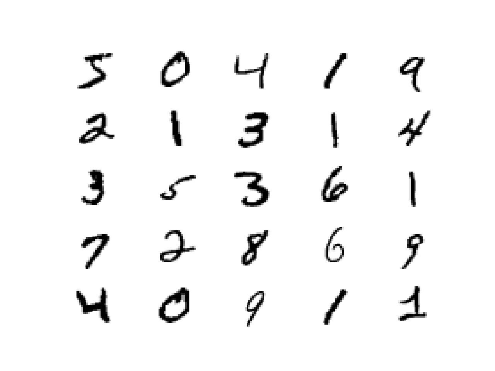

# Neural Network Implementation with Numpy
> The project was done for an introductory course in artificial intelligence. The work was done in groups of two.

The project aimed to implement a simple artificial neural network in python using numpy. To then evaluate the implementation, the famous MNIST dataset was used where we acheived a **96%** accuracy. To further investigate the topic, we created our own very small dataset using paint and with that we achieved a **70%** accuracy. More information about how the neural network was implemented can be found in the project [report](Neural-Network_Report.pdf).

<p align="center">
  
</p>

## Usage example
First you need to install the requirements found in the requirements.txt file. This is preferably done inside a virtual environment.
```sh
pip install -r requirements.txt
```
After that, the following command can be run to construct and train a network.
```sh
python main.py 784 100 10 NN.bin
```

## Development setup

Python 3 is required.


## Meta

Erik Båvenstrand – [Portfolio](https://bavenstrand.se) – erik@bavenstrand.se

Distributed under the MIT license. See ``LICENSE`` for more information.

[github.com/ErikBavenstrand](https://github.com/ErikBavenstrand)